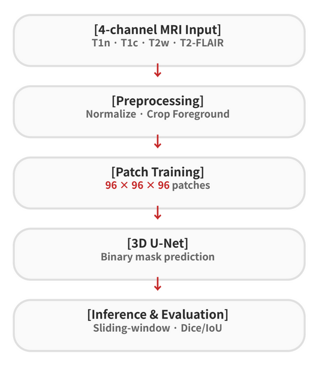
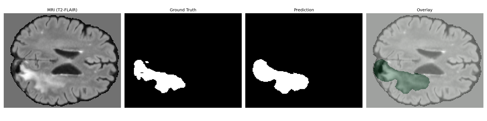
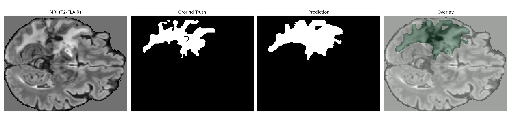
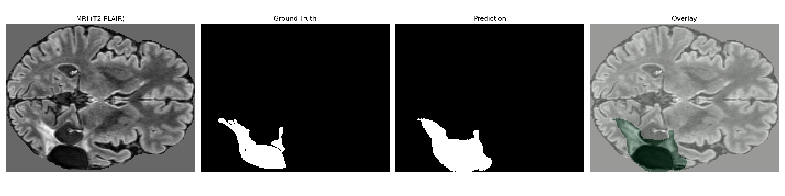

# 3D Brain MRI Tumor Segmentation Pipeline (BraTS)

## 1. Project Overview

This project implements a **3D medical image segmentation pipeline** for brain tumor segmentation using multi-modal MRI data from the BraTS dataset.

The goal of this project was not only to train a segmentation model, but to build and analyze a practical 3D segmentation workflow:

- loading multi-modal 3D MRI volumes
- converting BraTS labels into binary whole-tumor masks
- training a 3D U-Net with patch-based sampling
- evaluating full-volume predictions with sliding-window inference
- analyzing false positives through prediction threshold tuning
- visualizing prediction masks against ground truth

This project was approached as a **pipeline design, evaluation, and optimization task**, rather than a simple model implementation.

The final pipeline was validated on a held-out test set and achieved Dice 0.6366 and IoU 0.4882 for binary whole-tumor segmentation.

---

## 2. Problem Definition

Brain tumor segmentation from MRI is challenging because:

- MRI data is volumetric and must be handled in 3D
- different MRI modalities provide complementary tumor information
- tumor boundaries can be ambiguous
- tumor regions occupy a much smaller area than background tissue
- prediction masks can easily become over-segmented

In this project, the task was simplified into:

> **Binary whole-tumor segmentation from multi-modal 3D MRI volumes**

All non-zero BraTS tumor labels were converted into a single tumor class:

```python
label > 0  -> tumor
label == 0 -> background
```

---

## 3. Dataset and Input Design

### 3.1 Dataset

- Dataset: BraTS 2024 training data subset
- Final experiment setup:
  - 100 selected cases
  - 80 training cases
  - 10 validation cases
  - 10 held-out test cases

Each case includes four MRI modalities and one segmentation label:

- T1n
- T1c
- T2w
- T2-FLAIR
- segmentation label

---

### 3.2 Multi-modal Input Strategy

The four MRI modalities were combined into a 4-channel input volume:

```text
Input = [T1n, T1c, T2w, T2-FLAIR]
```

Each modality provides different information:

| Modality | Role |
|---|---|
| T1n | anatomical structure |
| T1c | contrast-enhancing tumor information |
| T2w | fluid and tissue contrast |
| T2-FLAIR | edema and tumor-related abnormal regions |

---

## 4. Pipeline Design

## Pipeline Overview



### 4.1 Preprocessing

The preprocessing pipeline was implemented with MONAI transforms:

- NIfTI volume loading
- channel-first conversion
- channel-wise intensity normalization
- foreground cropping
- tensor conversion

For training, patch-based sampling was used:

```text
Patch size = 96 × 96 × 96
```

This was necessary because full 3D MRI volumes are too large to train directly under GPU memory constraints.

---

### 4.2 Training Strategy

Patch-based training was used with positive/negative sampling so that the model could learn from both tumor-containing and background regions.

Training augmentation included:

- random flip
- random 90-degree rotation

The model was trained as a binary segmentation model using whole-tumor masks.

---

## 5. Model Architecture

The model used in this project was a MONAI 3D U-Net.

| Item | Setting |
|---|---|
| Model | 3D U-Net |
| Framework | MONAI / PyTorch |
| Input channels | 4 |
| Output channels | 1 |
| Task | Binary whole-tumor segmentation |
| Inference | Sliding-window inference |

The 3D U-Net was selected because it is a strong and practical baseline for medical image segmentation tasks.

---

## 6. Training Setup

The final training setup used:

- Loss: DiceCE Loss
- Optimizer: Adam
- Learning rate scheduler: ReduceLROnPlateau
- Patch size: 96 × 96 × 96
- Validation method: full-volume sliding-window inference
- Prediction activation: sigmoid
- Final prediction threshold: 0.95

The loss function used sigmoid internally during training. During validation and evaluation, sigmoid was applied explicitly before thresholding the prediction mask.

---

## 7. Evaluation Method

Evaluation was performed on the validation split using full-volume sliding-window inference.

Metrics:

- Dice Score
- IoU

The evaluation pipeline used:

```text
model logits -> sigmoid -> threshold -> binary prediction mask
```

Because the model initially produced over-segmented masks, prediction thresholds were compared on the validation set.

---

## 8. Quantitative Results

### 8.1 Threshold Tuning

The model initially produced prediction masks that were larger than the ground truth masks. To reduce false positives, sigmoid prediction thresholds were compared.

| Prediction Threshold | Dice Score | IoU |
|---:|---:|---:|
| 0.85 | 0.6632 | 0.5114 |
| 0.90 | 0.6762 | 0.5255 |
| 0.95 | **0.6830** | **0.5320** |

The best validation result was achieved with a threshold of **0.95**.

---

### 8.2 Final Result

### Validation Result

Task       : BraTS Whole Tumor Binary Segmentation
Cases      : 10
Threshold  : 0.95
Dice       : 0.6830
IoU        : 0.5320

### Held-out Test Result

Task       : BraTS Whole Tumor Binary Segmentation
Cases      : 10
Threshold  : 0.95
Dice       : 0.6366
IoU        : 0.4882

---

## 9. Qualitative Results

The model was visualized using four panels:

1. MRI input slice
2. Ground truth mask
3. Prediction mask
4. Prediction overlay on MRI

Example layout:

```text
MRI (T2-FLAIR) | Ground Truth | Prediction | Overlay
```

Qualitative observations:

- the model captures the main tumor region
- predicted masks generally overlap with the ground truth
- boundary details are still less precise
- irregular tumor shapes remain challenging

Add result images here:

### Case 1



### Case 2



### Case 3



---

## 10. Error Analysis

### 10.1 Initial Problem: Over-segmentation

During evaluation, the model tended to predict tumor regions too broadly.

This was confirmed by comparing predicted voxel counts with ground truth voxel counts:

```text
predicted tumor voxels > ground truth tumor voxels
```

This caused many false positives and reduced IoU.

---

### 10.2 Threshold Analysis

Lower thresholds produced wider prediction masks and increased false positives.

Higher thresholds reduced the predicted mask size and improved Dice/IoU.

The best result was obtained at threshold 0.95, indicating that the model required a stricter decision threshold to reduce over-segmentation.

---

## 11. Strengths

- implemented a complete 3D medical image segmentation pipeline
- used 4-channel multi-modal MRI input
- applied patch-based 3D U-Net training
- evaluated full 3D volumes with sliding-window inference
- analyzed prediction behavior using voxel counts and threshold tuning
- produced both quantitative metrics and qualitative visualizations

---

## 12. Limitations

- the task was simplified to binary whole-tumor segmentation
- tumor sub-regions were not modeled separately
- the model still struggles with fine boundaries and irregular tumor shapes
- validation was performed on a subset of the full dataset
- threshold tuning was selected on the validation set and evaluated on a held-out test set

---

## 13. Future Work

Possible improvements include:

- training with more BraTS cases
- multi-class segmentation for tumor sub-regions
- experimenting with stronger architectures such as Attention U-Net or UNETR
- adding 3D connected component post-processing
- improving probability calibration
- optimizing inference speed and memory usage

---

## 14. Key Takeaways

This project showed that 3D medical image segmentation requires more than simply training a model.

Important lessons:

- multi-modal input design is critical for MRI segmentation
- patch-based training enables 3D learning under GPU memory limits
- full-volume sliding-window inference is necessary for realistic validation
- Dice/IoU should be evaluated on full 3D volumes, not only selected slices
- threshold tuning can reveal and reduce false positive behavior
- qualitative visualization is important for understanding segmentation errors

---

## 15. Conclusion

This project demonstrates a complete MONAI-based 3D brain tumor segmentation pipeline.

The final pipeline includes:

- multi-modal MRI loading
- binary whole-tumor label conversion
- patch-based 3D U-Net training
- full-volume sliding-window inference
- Dice/IoU validation
- threshold-based false positive analysis
- qualitative result visualization

Final Results

Validation:
> **Dice 0.6830 / IoU 0.5320**

Held-out Test:
> **Dice 0.6366 / IoU 0.4882**

The main contribution of this project is not only the final score, but the process of building, evaluating, debugging, and improving a practical 3D medical image segmentation pipeline.